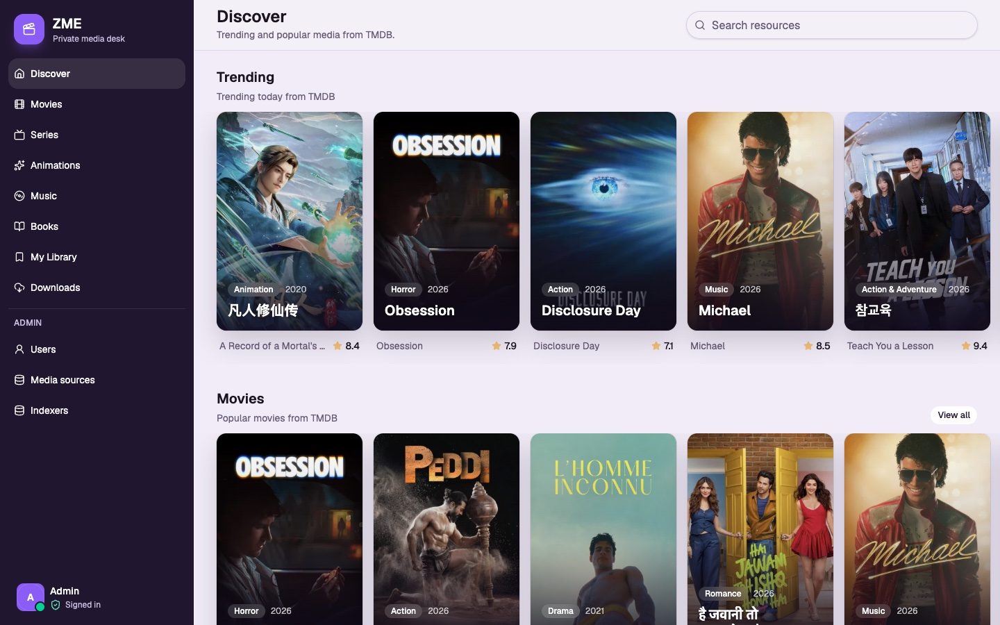
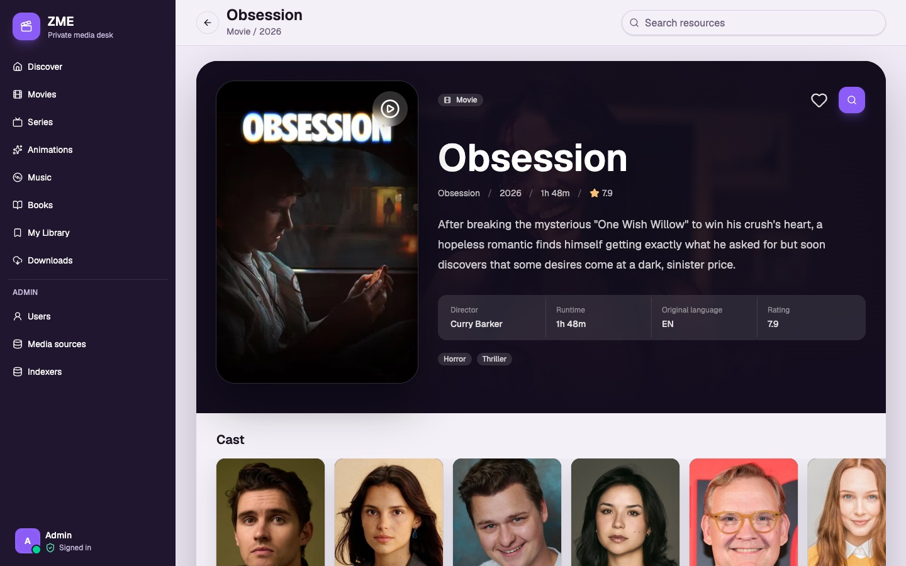
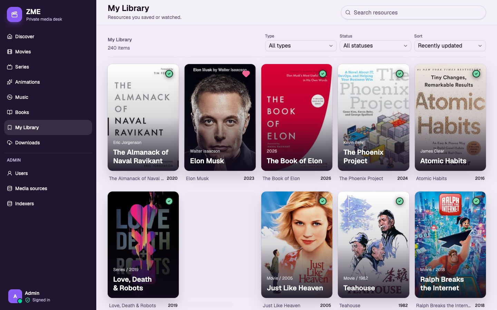
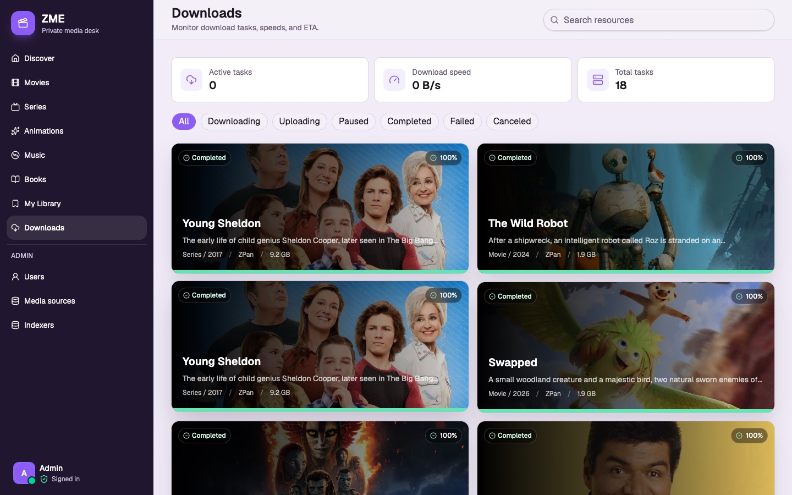

<div align="center">

# ZME

**A private media desk — discover movies, series, anime, music, and books, then push a release straight to your downloader.**

[](#license)




</div>

## What is ZME?

ZME is a self-hosted, single-page web app that unifies media **discovery** and
**acquisition** in one surface. Browse trending and popular titles pulled from
TMDB (movies / series / anime), Open Library (books), and ListenBrainz (music);
open a title for rich detail; then search your indexers for a release and hand it
off to your download client — all without leaving the page.

It runs entirely on Cloudflare's edge: a [Hono](https://hono.dev) API on
[Workers](https://workers.cloudflare.com) serves the React SPA as static assets and
keeps state in [D1](https://developers.cloudflare.com/d1/). There's no always-on
server to babysit.

## What problem does it solve?

Self-hosted media stacks are powerful but fragmented: you discover something in one
app, search for a release in another (Prowlarr), and queue it in a third
(qBittorrent / Transmission / …). ZME collapses that loop into a single private desk:

- **One place to discover** across movies, series, anime, music, and books.
- **One step from a title to a release** — ZME queries your configured indexers
  (via Prowlarr) for you.
- **One step from a release to a download** — push it straight to your
  **download client**, no copy-pasting magnet links.
- **A personal library and a download monitor** to track what you saved and how
  downloads are progressing.

Everything is admin-managed and private: there's no public sign-up, and your API
keys and indexer / downloader endpoints stay inside your own deployment.

## Screenshots

| Title detail | My Library | Downloads |
| :---: | :---: | :---: |
| [](docs/screenshots/media-detail.jpg) | [](docs/screenshots/library.jpg) | [](docs/screenshots/downloads.jpg) |

## Getting started

### Prerequisites

- **Node.js ≥ 24** and **pnpm 10**
- A **TMDB API key** for discovery (configured inside the app)
- Optional, but that's the point: a **Prowlarr** instance for indexer search and a
  **download client** (qBittorrent / Transmission / Aria2 / ZPan)

### Run it locally

```bash
git clone https://github.com/saltbo/zme.git
cd zme
pnpm install
```

Create a `.dev.vars` file with an auth signing secret (≥ 32 characters):

```dotenv
BETTER_AUTH_SECRET=replace-with-at-least-32-random-characters
```

Then start the dev server:

```bash
pnpm dev          # → http://localhost:7171
```

On first launch ZME opens an **onboarding flow** to create the first administrator.
After signing in, connect your **media sources**, **indexers**, and **downloaders**
from the Admin area — ZME doesn't run indexers or downloaders itself, it talks to
the services you point it at.

### Deploy to Cloudflare

```bash
wrangler secret put BETTER_AUTH_SECRET   # set the auth secret on the Worker
pnpm db:migrate:remote                   # apply D1 migrations
pnpm deploy
```

## Tech overview

| Layer | Stack |
| --- | --- |
| Frontend | React 19, React Router 7, TanStack Query, Tailwind CSS 4, i18n (中文 / English) |
| Backend | Hono RPC API on Cloudflare Workers, serving the SPA as static assets |
| Data | Cloudflare D1 (SQLite) via Drizzle ORM; Better Auth for sessions |
| Integrations | TMDB, Open Library, ListenBrainz (discovery) · Prowlarr (indexers) · qBittorrent / Transmission / Aria2 / ZPan (downloaders) |
| Tooling | TypeScript, Biome, Vitest, Playwright, Wrangler, pnpm |

The server follows a clean, layered architecture (domain → use cases → adapters →
HTTP) with the two halves meeting only through a shared API contract. The full
layout, boundaries, and conventions live in the contributor guide — see below.

## Contributing

Contributions are welcome. The development workflow, architecture, gates, testing
tiers, and database/codegen conventions are documented in
**[CONTRIBUTING.md](CONTRIBUTING.md)**. The design system reference is in
[DESIGN.md](DESIGN.md).

## Disclaimer

ZME is intended for **self-hosted, personal or household use only**. It is a
discovery and download-orchestration interface — it hosts and distributes no
media itself, and only talks to the third-party services (metadata providers,
indexers, and download clients) that *you* configure. You are solely responsible
for how you use it and for complying with the laws and the terms of those
services in your jurisdiction.

**Running this project for commercial purposes is entirely at your own risk; you
assume all resulting legal liability.** The software is provided "as is", without
warranty of any kind, as set out in the license below.

## License

[AGPL-3.0-only](https://www.gnu.org/licenses/agpl-3.0.en.html).
